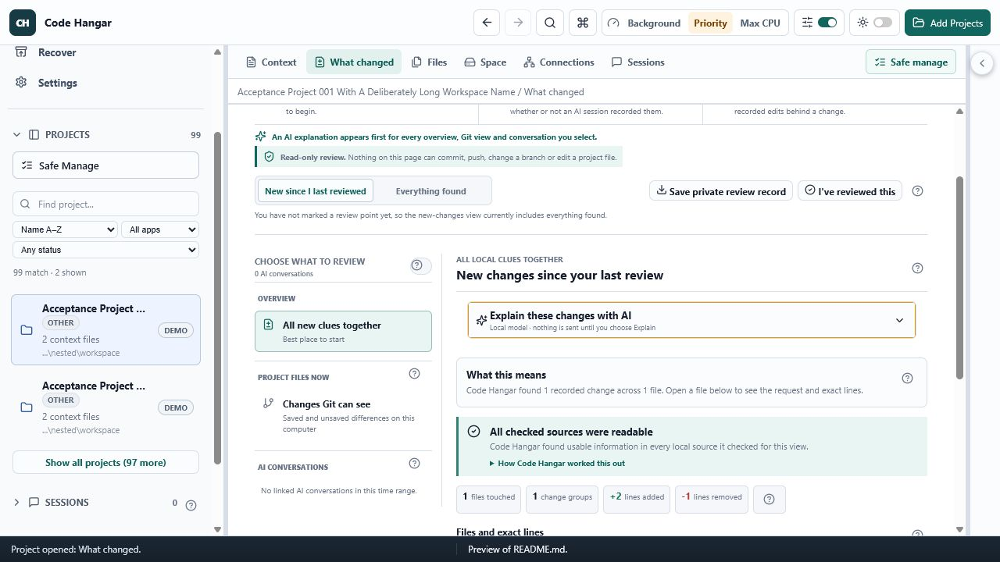
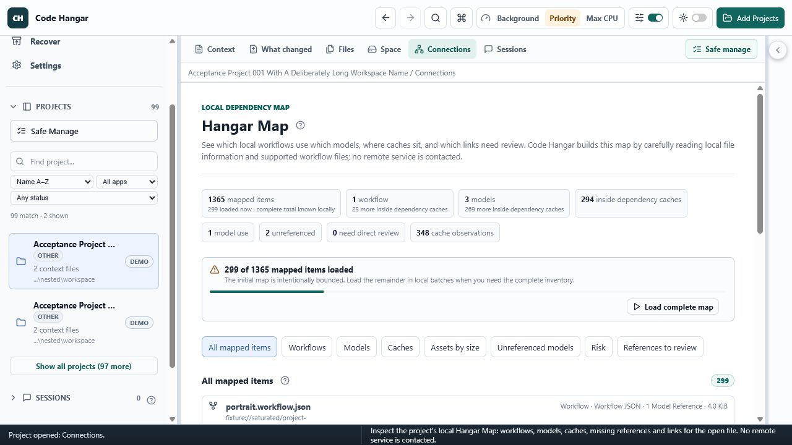
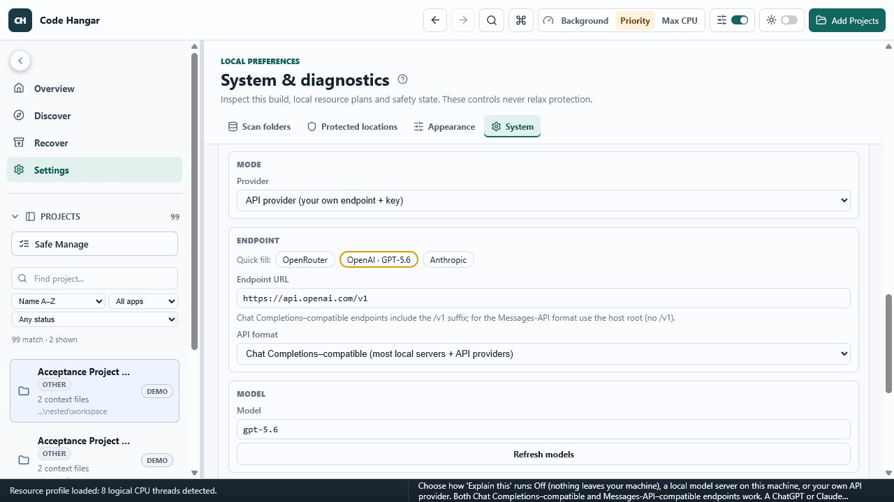

# Code Hangar — OpenAI Build Week submission

> Submission-preparation draft. The privacy-sanitized source is public at
> <https://github.com/jcomlabs/code-hangar>; Devpost, YouTube, `/feedback`, and
> the final competition submission remain explicitly owner-gated.

## One-line pitch

**Code Hangar is the flight recorder for vibe coding:** it reconstructs the
best-supported record of what AI coding tools changed from deterministic local
evidence, then lets GPT-5.6 in Codex inspect that curated record through a
scoped local MCP connection without copying a ChatGPT credential into the app.

## Category

**Developer Tools**

## Why it exists

AI-assisted development leaves useful but fragmented evidence across project
files, Git state, Codex and other tool sessions, local model stores, and caches.
The hard problem is not generating one more change. It is answering, with
appropriate uncertainty:

- What did an AI actually change?
- Which evidence is complete, partial, or missing?
- Is it safe to share the selected context with a model?
- Can a small correction be reviewed and reversed?

Code Hangar makes that retrospective workflow a product rather than a manual
forensics exercise.

## The judge journey

1. **Review the evidence first.** The Review Inbox and per-project recap combine
   supported session edits, current local Git evidence, current-file comparison,
   and encrypted review history. Coverage and unknowns appear before any
   explanation.
2. **Inspect the exact context.** Source and recorded changes remain visible; the
   product does not replace evidence with a model summary.
3. **Ask GPT-5.6 deliberately.** The primary path connects Codex to Code Hangar's
   project-scoped MCP sidecar. Codex owns the ChatGPT sign-in and GPT-5.6 model;
   Code Hangar exposes only the curated local evidence the user granted. The
   optional in-app AI Assist remains Off by default and separately supports a
   local server or the user's provider API after exact-request review.
4. **Correct one thing, safely.** Corrections are deliberately small,
   review-bound, validated, snapshotted, and reversible. Code Hangar is not a
   whole-project autonomous rewrite tool.

## Where Codex and GPT-5.6 fit

Codex was used as the engineering collaborator for the Build Week work: auditing
the existing product, implementing bounded improvements, writing regression
tests, validating edition isolation, and preparing judge-facing evidence.

- **Primary core-build thread (continued in the eligible window):**
  `019f3315-12ff-7071-8534-04fe50ed534e`
- **Candidate-finalization session:** `019f7226-c01a-71d3-9850-4c6f3b990ef2`
- **Required `/feedback` action:** pending explicit owner authorization; no
  feedback receipt or external submission is claimed here.

GPT-5.6 is a user-invoked explanatory layer, not the source of truth. The
primary live proof now uses **MCP out**: Codex signed in with ChatGPT ran
`gpt-5.6-sol`, called Code Hangar's scoped `list_catalog` and
`get_project_context` tools against a synthetic project, returned the expected
project, and left both allowed reads in the Code Hangar audit log. The temporary
credential was revoked and only a sanitized, gitignored result was retained.
The final proof used the MCP sidecar installed by the exact Connector candidate.

The Connector also has **AI in**: the existing in-app AI Assist can call a local
server or a configured provider. Its direct OpenAI GPT-5.6 request contract and
safety gates are tested, but a separately paid API-key round trip is optional,
not a submission blocker. OpenAI's Codex app-server provides a documented future
way to bring ChatGPT-authenticated output into Code Hangar; that adapter is not
implemented or claimed as shipped. See the
[dual-path plan](docs/submission/DUAL_PATH_PLAN.md).

## Two builds, one explicit boundary

| Build | Role in the submission | Network posture |
|---|---|---|
| **Code Hangar — AI Connector** | Primary judge build; exposes scoped MCP to Codex and contains optional in-app AI Assist | MCP is local stdio; only user-configured AI Assist makes outbound calls; no telemetry or updater |
| **Code Hangar (Local)** | Isolation proof; the same local retrospective workflow without Connector capability | Outbound AI and connector code are absent from the build |

The Connector is the main submission because it demonstrates Codex collaboration
and GPT-5.6 consuming Code Hangar evidence through the shipped MCP sidecar. The
Local build is the stronger privacy proof: optional AI capability is physically
edition-gated rather than hidden behind a visual toggle.

## Project and Build Week boundary

Code Hangar is a pre-existing project. The declared comparison baseline is
commit `843530c` from **12 July 2026**. Work presented as Build Week work began
on **14 July 2026**. The frozen product candidate is:

- **Baseline:** `843530c`
- **Product candidate commit:** `e831c14dfa15291dda152d7742766221438feaa3`
- **Build Week comparison:** `843530c..e831c14dfa15291dda152d7742766221438feaa3`
- **Branch tip:** a contiguous later documentation/proof-harness stack; no
  product runtime or packaged binary changes after the candidate hash above.

See [Build-period delta](docs/submission/BUILD_PERIOD_DELTA.md) for the auditable
split between reusable product work and submission-only material.

## Prepared visual proof

The images below were captured on 17 July 2026 from the Connector browser
fixture with synthetic `fixture://` data. They prove deterministic interface
states, not a live OpenAI response. The browser console had zero warnings and
zero errors during the capture.

See [asset provenance](docs/submission/assets/README.md) for the exact fixture
state and limitations.

## Judge resources

- [Judge quickstart](docs/submission/JUDGE_QUICKSTART.md)
- [Under-three-minute demo script](docs/submission/DEMO_SCRIPT.md)
- [GPT-5.6 dual-path plan](docs/submission/DUAL_PATH_PLAN.md)
- [Devpost form draft](docs/submission/DEVPOST_DRAFT.md)
- [Technical proof matrix](docs/submission/TECHNICAL_PROOF.md)
- [Final evidence manifest](docs/submission/EVIDENCE_MANIFEST.md)
- [Build-period delta](docs/submission/BUILD_PERIOD_DELTA.md)
- [0.1.2 candidate release notes](docs/submission/RELEASE_NOTES.md)
- [Submission checklist](docs/submission/SUBMISSION_CHECKLIST.md)
- [Owner handoff](docs/submission/OWNER_HANDOFF.md)
- [Main project README](README.md)
- [Security invariants](SECURITY_INVARIANTS.md)

## Submission fields still requiring owner action

| Field | Value |
|---|---|
| Devpost | Account created (owner reported); event registration, project draft, and submission still pending |
| Public project/repository URL | <https://github.com/jcomlabs/code-hangar> |
| Public YouTube demo, under three minutes, with audio | Pending recording and owner authorization |
| Codex session selected for `/feedback` | `019f3315-12ff-7071-8534-04fe50ed534e`; external `/feedback` action pending authorization |
| Primary Connector installer | Public release rebuild pending |
| Local isolation-proof installer | Public release rebuild pending |
| Final Connector SHA-256 | `ffa66b3033ac4cd51e017bb2592f9e37dcbc8f688faff9f82f10a065d926d241` |
| Final Local SHA-256 | `52288762d0de48403cd545852374178bf6cb72815f0c1c7c08d14fb0ee521a47` |
| Native candidate lifecycle | Both exact 0.1.2 editions installed, launched with isolated application profiles, showed the expected edition boundary, and uninstalled on the host; separate clean Sandbox attempts were blocked pre-setup by Application Control |
| Live GPT-5.6 evidence | Local GPT-5.6 Sol + Code Hangar MCP subscription proof passed through the installed candidate sidecar; final public native video capture pending |

The [official Build Week rules](https://openai.devpost.com/rules) set the
deadline at **21 July 2026 at 5:00 PM PT**. This candidate uses English for the
submission, audible demo narration, repository-facing documentation, and form
copy so no translation track is required. The
[official event page](https://openai.com/build-week/) and
[Devpost project page](https://openai.devpost.com/) are the external source of
truth for the final submission fields.

## Submission-only isolation

This file, `docs/submission/`, `scripts/submission/`, and the `0.1.2` version
bump are event-specific packaging. They live only on
`submission/openai-build-week`, above the clean public `main`. Reverting that
branch layer removes the event material without removing general Code Hangar
improvements or the reusable GPT-5.6 integration already present on `main`.

No Build Week branding belongs in the product UI.
