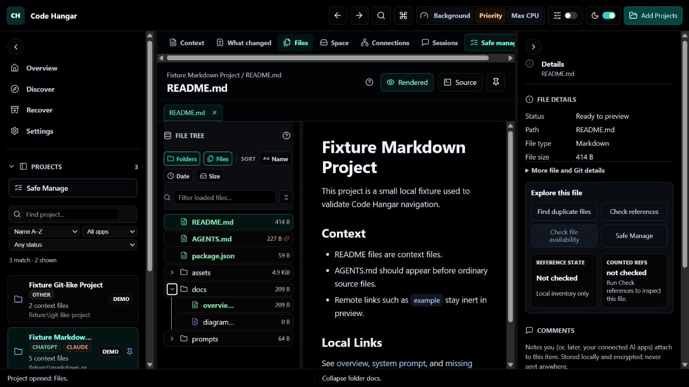
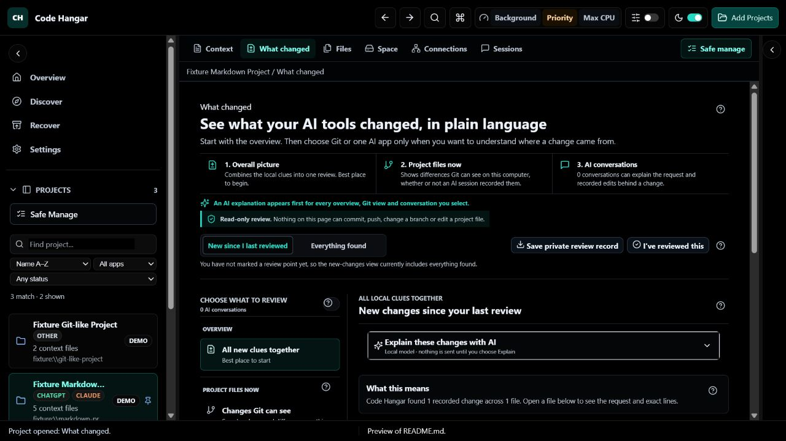

# Code Hangar

**A local-first control centre for understanding what AI coding tools did to your projects.**

[](https://github.com/jcomlabs/code-hangar/actions/workflows/ci.yml)
[](LICENSE)

> **Status: early alpha (`0.1.x`).** The core navigator, discovery, safety layer
> and optional connector are built and tested; expect rough edges and breaking
> changes before 1.0. See [known issues](KNOWN_ISSUES.md).

Claude Code, ChatGPT, Cursor, Antigravity, Hermes, OpenClaw, Pinokio and similar tools scatter projects, conversation transcripts, model files and caches across your disk. Code Hangar inventories all of it — entirely on your computer — so you can find it, understand it, navigate it, and clean it up safely.

It is **not** an IDE, an autonomous coding agent, a chat client or a generic disk cleaner. It is a retrospective workspace for vibe coders: reconstruct what an AI recorded, understand the affected code, and make at most one small reversible correction at a time.



---

## What it does

Six things, built around local evidence:

1. **Discovers your AI work.** Finds the projects and the tool sessions/conversations attached to them across the AI coding apps you use — Claude Code, ChatGPT, Cursor, Antigravity, plus Hermes / OpenClaw / Pinokio — read straight from each app's own store, on Windows and (optionally) WSL, grouped by app, with the real transcripts.
2. **Shows what changed.** A cross-project Review Inbox finds session records newer than each saved checkpoint. Recap combines supported session edits, current local Git evidence, current-file comparison and encrypted review history. Coverage and unknowns appear before the diff; missing evidence is never invented. A private-safe Review Receipt exports counts and evidence limits without project identity, prompts, diffs, file names or paths.
3. **Helps you read code.** Safe source highlighting, plain-language context, Explain and What to check, bounded walkthroughs and grounded follow-up teach the reader instead of hiding the code.
4. **Changes one thing safely.** Project-file changes start locked and require the exact project name to unlock for that app session. Recognised values, an advanced one-file text draft and one selected AI suggestion are previewed, validated, snapshotted and reversible. Manual and value changes show the exact local line diff plus read-only Git context before applying; Code Hangar never stages, commits, pushes or changes branches. Whole-project and multi-file AI rewrites do not exist.
5. **Backs up and removes safely.** A journaled, reversible pipeline: nothing is destroyed without a verified backup. Files move to a holding area you can restore from; permanent removal is **off by default**.
6. **Keeps AI optional and local-first.** The Connector edition can use a local loopback model server or a provider you configure. It shows the exact request, blocks secrets before send, streams local responses and maintains an advisory per-session token meter. The Local edition contains none of this network code.



## Two editions

Code Hangar ships as two editions built from the same source tree.

| Edition | Who it's for | AI / network |
|---|---|---|
| **Code Hangar (Local)** | Anyone who wants the local catalog and the safe backup/remove pipeline with **zero** external access. The connector/AI code is *physically absent* from this build (CI-enforced). | none — no account, no telemetry, no outbound network |
| **Code Hangar — AI Connector** | People who also want the optional AI assist and want their AI apps to read (and, with explicit approval, act on) the curated knowledge over the Model Context Protocol (MCP). | only the local model server or provider **you** configure; MCP over a local channel only |

**The base (Local) edition never phones home.** It has no outbound network capability at all — the AI and connector code is not compiled into it, which is asserted in CI. The AI Connector edition adds only the calls you opt into: an AI assist that talks to the local model server or API endpoint you choose, and an MCP channel that speaks over a local stdio / named-pipe connection — never the internet.

Even in the Connector edition, every privileged action an AI app requests is **queued for your in-app approval** — the AI app never executes anything itself. See **[docs/connect-your-ai-app.md](docs/connect-your-ai-app.md)** for the full connection flow and the total-control model.

To use the review and learning layer with zero cloud, see **[Connect your local model](docs/connect-your-local-model.md)**.

## Safety

The backup-and-remove pipeline is built to be reversible and hard to misfire:

- **Backup before delete is enforced** — nothing is removed without a backup that is verified to cover the file (content-hash bound).
- **Reversible by default** — files you clean up move to a holding area (quarantine) that you can restore from.
- **Permanent removal is off by default** — the one irreversible step must be explicitly enabled in Recover, and even then each removal still needs a verified backup plus a fresh confirmation. On any error the gate fails closed.
- **Journaled and crash-consistent** — the pipeline records what it is doing so an interrupted operation can recover rather than leave a half-finished mess.

This pipeline passed a 10-scenario adversarial battery (crash consistency, interrupted-restore recovery, holding-area collisions, backup-covers-file) with **zero data loss**.

## Privacy & security

Code Hangar is local-first by design:

- **No account and no telemetry.** The Local edition has no outbound network capability. The AI Connector edition adds only the opt-in AI Assist calls to the provider or local model server you configure.
- **Encrypted at rest.** The local index is a SQLCipher-encrypted database, with its key bound to your Windows user account (DPAPI).
- **Sensitive files stay protected** — secrets, `.env`, key material and other Protected Zones are excluded from preview and search, and are hard-blocked before anything is sent to an AI assist.
- **Support exports are redacted by construction** — the diagnostics bundle contains build/safety facts and aggregate counts, never project or file identity, paths, sessions, prompts, source, diffs, logs, endpoints, credentials or model configuration.
- **Destructive actions are gated** — backup-before-delete is enforced; the irreversible permanent-delete is opt-in and always requires a verified backup plus a fresh confirmation.

See the public [`SECURITY.md`](SECURITY.md) policy and
[`SECURITY_INVARIANTS.md`](SECURITY_INVARIANTS.md) for the detailed security model.

## Install

Download the installer for the edition you want from the
[Releases page](https://github.com/jcomlabs/code-hangar/releases) and run it
(per-user install, no admin required):

- `Code Hangar_x.y.z_x64-setup.exe` — **Local** edition. Full local management including safe backup and delete (backup → holding → final removal, off by default); 100% local, no AI, no outbound network.
- `Code Hangar AI Connector_x.y.z_x64-setup.exe` — **AI Connector** edition. Shares the same local catalog (same app data) and adds AI Assist + the AI app integration panel.

Both editions read and write the **same** encrypted local catalog, so you can install either (or both) and switch later without losing your inventory.

> Windows only for now. WSL projects are catalogued from Windows; there is no native Linux/macOS build yet.

> **Unsigned builds:** until the installers are code-signed, Windows SmartScreen may warn about an "unknown publisher". Choose **More info → Run anyway**.

## Build from source

Requires Rust stable, Node 24, and the Tauri prerequisites for Windows.

```sh
npm ci

# Connector edition installer (builds + bundles code-hangar-mcp.exe as a sidecar)
npm --workspace apps/desktop run package:connector

# Local edition installer  ->  target/release/bundle/nsis/
# Build this last if you build both editions; it cleans any staged connector sidecar.
npm --workspace apps/desktop run package:local
```

See [`docs/PACKAGING.md`](docs/PACKAGING.md) for the full release process and [`RELEASE_CHECKLIST.md`](RELEASE_CHECKLIST.md) for the owner's publish checklist (signing, checksums, publishing).

## Development

```powershell
npm ci
npm run dev            # vite dev server
npm run check          # tsc + vitest + dependency/forbidden-code guardrails
npm --workspace apps/desktop run tauri:dev   # run the desktop app
```

Full local gate before important pushes (this Windows machine):

```powershell
powershell -ExecutionPolicy Bypass -File scripts/local-ci.ps1                 # core + mutation lanes
powershell -ExecutionPolicy Bypass -File scripts/local-ci.ps1 -AgentAutomation  # also the connector build
```

GitHub Actions runs the deterministic Windows gate on pushes and pull requests.
The fuller local release gate above remains required before packaging. The
Rust/Tauri commands need a local toolchain with `cargo` on `PATH`.

Architecture and internals: [`AGENTS.md`](AGENTS.md), [`SECURITY_INVARIANTS.md`](SECURITY_INVARIANTS.md), [`docs/`](docs/), and the master spec / implementation-plan documents in the repo root.

Contributions should start with [`CONTRIBUTING.md`](CONTRIBUTING.md). Dependency
and asset provenance is recorded in [`SOURCES.md`](SOURCES.md) and
[`THIRD_PARTY_NOTICES.md`](THIRD_PARTY_NOTICES.md).

## License

Licensed under the [Apache License 2.0](LICENSE).
