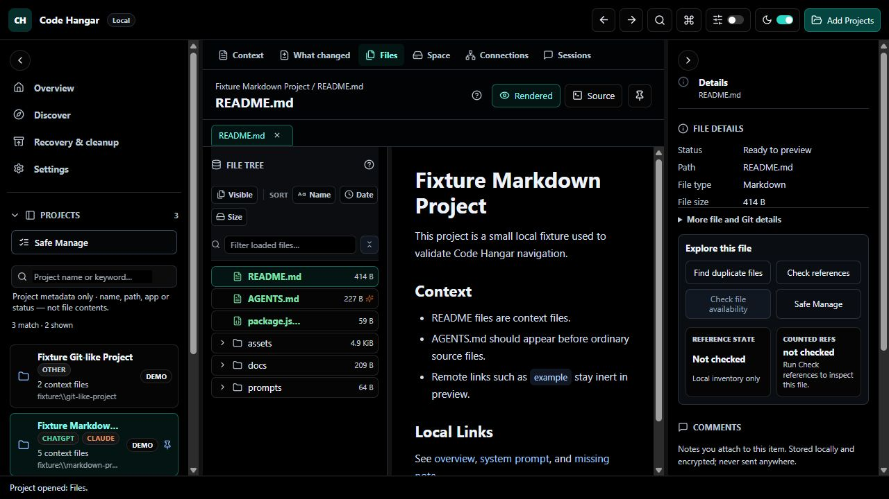
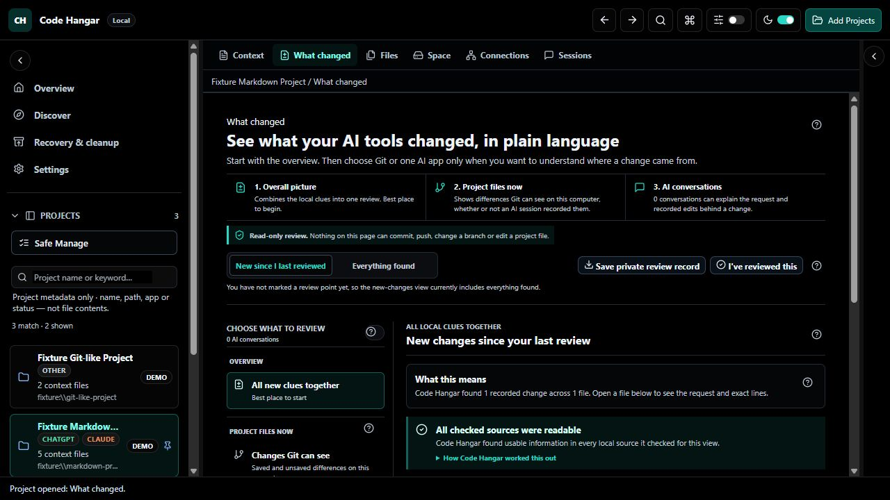

# Code Hangar

**A local-first, cross-project explorer for navigating projects, Markdown and the work AI coding tools left behind.**

[](LICENSE)

> **Status: early alpha (`0.1.x`).** The core navigator, discovery, safety layer
> and optional connector are under release hardening; no public `0.1.3`
> candidate is approved yet. Expect rough edges and breaking changes before 1.0.
> See [known issues](KNOWN_ISSUES.md).

Code Hangar starts as a fast project explorer: open a Markdown/text file or a project folder from Windows File Explorer and move through the right project without changing tools. A file inside a known project opens there immediately; an unknown file opens immediately in an isolated temporary Viewer, without registering its parent or aggregating sessions. Unknown folders still ask whether to use that Viewer, detect the nearest project root automatically, or use a root you choose manually. Project modes then correlate that local root with the work OpenCode, Oh My Pi, Claude Code, ChatGPT, Cursor, Antigravity, Hermes, OpenClaw, Pinokio and similar tools left across your disk — entirely on your computer.

It is **not** an IDE, an autonomous coding agent, a chat client or a generic disk cleaner. It is a retrospective workspace for vibe coders: reconstruct what an AI recorded, understand the affected code, and make at most one small reversible correction at a time.



---

## What it does

Seven things, built around local evidence:

1. **Opens projects from Windows — without waiting for a scan.** Register Code Hangar as an optional Markdown handler and add reversible File Explorer actions for text files and folders. A file is safely previewed directly first: known files land in their project; unknown files land in a temporary isolated Viewer. The read-only scan, navigation update and app/session correlation continue behind the open file. Unknown folders explicitly offer Viewer, Automatic (detect/register the nearest recognised root, falling back to the selected folder), or Manual (the user selects a containing root).
2. **Discovers your AI work.** Finds the projects and the tool sessions/conversations attached to them across the AI coding apps you use — OpenCode, Oh My Pi, Claude Code, ChatGPT, Cursor, Antigravity, plus Hermes / OpenClaw / Pinokio — read straight from each app's own store, on Windows and (optionally) WSL, grouped by app, with the real transcripts.
3. **Shows what changed.** A small local change tracker records created, modified and removed file metadata after each project's silent baseline; it never stores file bodies or pretends to know which app caused a change. A cross-project Review Inbox finds session records newer than each saved checkpoint. Recap combines supported session edits, current local Git evidence, current-file comparison and encrypted review history. Coverage and unknowns appear before the diff; missing evidence is never invented. A private-safe Review Receipt exports counts and evidence limits without project identity, prompts, diffs, file names or paths.
4. **Helps you read code.** Safe source highlighting, plain-language local context, relationship evidence and deterministic review tools teach the reader instead of hiding the code.
5. **Changes one thing safely.** Project-file changes start locked and require the exact project name to unlock for that app session. Recognised values and an advanced one-file text draft are previewed, validated, snapshotted and reversible. Changes show the exact local line diff plus read-only Git context before applying; Code Hangar never stages, commits, pushes or changes branches.
6. **Backs up and removes safely.** A journaled pipeline: nothing is destroyed without a verified recovery copy. Files first move to a holding area you can restore from; when you are ready, a visible project/batch review can permanently remove the proved held objects and release their storage.
7. **Connects AI coding apps and, only when you opt in, your chosen model provider.** The optional Connector can register its local MCP server with Claude, Codex and Cursor. MCP uses child-process stdio or a Windows named pipe; every project/action scope and mutation gate remains in Code Hangar. Connector-only AI Assist can send the exact text you review to an explicitly configured loopback model or HTTPS provider. Local contains none of that provider/client/key surface. Neither edition contains telemetry, an updater, remote-Git automation or implicit/background network activity.



## Two editions

Code Hangar ships as two editions built from the same source tree.

| Edition | Who it's for | AI / network |
|---|---|---|
| **Code Hangar (Local)** | Anyone who wants the local catalog and the safe backup/remove pipeline with **zero** external access. The connector/provider code is *physically absent* from this build (local-gate enforced). | none — no account, telemetry, AI provider, MCP or outbound network |
| **Code Hangar — AI Connector** | People who deliberately want scoped local MCP access from Claude, Codex or Cursor and/or AI Assist. This edition is optional, experimental and less tested than Local. | local MCP stdio / named pipe; optional explicit loopback or HTTPS provider requests only |

**Local never phones home.** Its graph and bundle reject `hangar-ai`, `reqwest`, `keyring`, provider chunks/IPC/copy and MCP; the ordinary Tauri graph may still contain the unrelated transitive `url` parser, so no false lockfile-wide zero-`url` claim is made. The AI Connector adds local MCP/app-configuration/named-pipe integration and one feature-gated provider client in `hangar-ai`. That client runs only for an explicit AI Assist operation after configuration and disclosure; telemetry, updater, remote Git, a second HTTP client and implicit/background traffic remain denied.

Even in the Connector edition, every privileged action an AI app requests is **queued for your in-app approval** — the AI app never executes anything itself. See **[docs/connect-your-ai-app.md](docs/connect-your-ai-app.md)** for the full connection flow and the total-control model.

## Safety

The backup-and-remove pipeline is built to be reversible and hard to misfire:

- **Backup before delete is enforced** — nothing is removed without a backup that is verified to cover the file (content-hash bound).
- **Reversible by default** — files you clean up move to a holding area (quarantine) that you can restore from.
- **Permanent removal is explicit, not hidden** — its Recovery capability starts OFF and requires the exact phrase `ENABLE PERMANENT REMOVAL`; disabling it blocks preview, confirmation and batch start. Enabling is only an availability gate: each immutable project/batch preview still needs its own short-lived confirmation and a verified object-complete recovery archive, while unsupported objects stay held with an exact reason.
- **Disk recovery is reported per volume** — Code Hangar distinguishes held allocation that will be released from recovery archives that remain. For a large cleanup, it recommends an archive destination on another volume instead of pretending that a same-volume archive freed the disk.
- **Journaled and crash-consistent** — the pipeline records what it is doing so an interrupted operation can recover rather than leave a half-finished mess.

An earlier 10-scenario adversarial battery retained every fixture byte in the
specific crash-consistency, interrupted-restore, holding-area-collision and
backup-coverage cases it exercised. That is valuable regression evidence, not a
universal zero-data-loss guarantee; the current final-removal guardian races and
signed Windows process matrix remain release gates.

## Privacy & security

Code Hangar is local-first by design:

- **No account, telemetry or outbound client in Local.** Connector adds local MCP plus one experimental, opt-in provider client; it does not contact a provider until you configure one and approve an operation's disclosed request.
- **Encrypted at rest.** The local index is a SQLCipher-encrypted database, with its key bound to your Windows user account (DPAPI).
- **Sensitive files stay protected** — secrets, `.env`, key material and other Protected Zones are excluded from preview, search and connected-app reads.
- **Support exports are redacted by construction** — the diagnostics bundle contains build/safety facts and aggregate counts, never project or file identity, paths, sessions, prompts, source, diffs, logs, endpoints, credentials or model configuration.
- **Destructive actions are gated** — backup-before-delete is enforced; every irreversible batch requires an exact preview, an object-complete verified recovery archive and a fresh single-use confirmation.

See the public [`SECURITY.md`](SECURITY.md) policy and
[`SECURITY_INVARIANTS.md`](SECURITY_INVARIANTS.md) for the detailed security model.

## Install

When a release has actually cleared HOLD and is published, download the edition
you want from the [Releases page](https://github.com/jcomlabs/code-hangar/releases)
and run it (per-user install, no admin required). Until then, there is no public
v0.1.3 installer to recommend; use the source-build/preflight instructions below
for development only.

- `Code Hangar_x.y.z_x64-setup.exe` — **Local** edition. Full local management including safe backup and delete (backup → holding → explicit final removal); 100% local, no connector and no outbound network.
- `Code Hangar AI Connector_x.y.z_x64-setup.exe` — **AI Connector** edition. Adds local Claude/Codex/Cursor MCP integration and an optional explicit loopback/HTTPS AI Assist provider. Shared-catalog/coexistence safety is not assumed; it must pass the final lifecycle below.

Both editions are designed around the **same** encrypted local catalog. For this
unpublished candidate, coexistence, edition switching, cross-uninstall and
inventory preservation are claims that the clean Windows lifecycle must still
prove; the shared identifier alone is not evidence that installing both is safe.

The installer separately asks whether to register Code Hangar in **Open with** for `.md`, `.markdown` and `.mdx`, and whether to add **Open in Code Hangar** for text files/folders. Both are per-user, optional and reversible under **Settings → System → Windows Explorer**. Windows does not permit the installer to force a default app: if you opt into Markdown registration, Code Hangar opens Windows Default Apps so the final choice remains yours.

The same Settings card can enable **Start quietly with Windows**. Closing the window then leaves Code Hangar resident in the notification area. A quiet sign-in launch keeps only the native tray and encrypted resident service; the WebView, project lists, dashboard summaries and global session rediscovery are created only when the window is actually opened. Every 30 seconds it checks only registered-root metadata; this is a detection-only probe, never a navigation-catalog query or whole-root scan. Focused Markdown/context fingerprints are checked while a project is open. One least-recent project gets a safety reconciliation every six hours; **Refresh now** in the tray can request the same work explicitly. A reconciliation admits one project, one below-normal-priority worker, small batches and deliberate yields. Repeated scans preserve the current inventory and write only new, changed or removed paths; an unchanged Markdown fingerprint is not reopened, while a new or changed Markdown file is still read through the no-recall gate and reindexed. Generated containers such as `.next`, `node_modules` and `target` remain visible as opaque nodes but are not recursively remeasured by the resident. The resident probe exposes root freshness promptly, while reconciliation keeps navigation, indexed Markdown and the change timeline current without turning continuously-changing session/build files into continuous scans; whole-project footprint, Markdown-relationship and workflow/model projections are deferred to foreground scans. **Exit Code Hangar** in the tray menu stops it completely. All of this is read-only and local: it does not edit, commit, fetch, upload or attribute changes to an app. This is local Phase 4 awareness, not agent automation, telemetry or an updater.

Projects inside **OneDrive are fully supported**, including resident refresh and app/session correlation. The default is cloud-safe: Code Hangar enumerates local metadata, indexes already-materialized files, and labels online-only entries **Cloud-only · content not indexed**. It enables Windows' explicit-placeholder process mode and opens bodies with `OPEN_NO_RECALL`, so a scan, search, preview or resident refresh fails closed instead of asking OneDrive to download bytes. Broad automatic discovery no longer walks OneDrive Documents/Desktop; app registries, local AI sessions, registered projects and an explicit bounded Deep Scan can still surface project roots inside OneDrive. Code Hangar never changes OneDrive pins. Under the base build's no-outbound invariant it also does not offer an in-app hydration button: use Explorer's **Always keep on this device** / ordinary explicit open, then rescan or reopen once Windows reports the bytes local.

> Windows only for now. WSL projects are catalogued from Windows; there is no native Linux/macOS build yet.

> **Unsigned builds:** until the installers are code-signed, Windows SmartScreen may warn about an "unknown publisher". Choose **More info → Run anyway**.

## Build from source

Requires Rust stable, Node 24, and the Tauri prerequisites for Windows.

```powershell
npm ci

# Choose one exact offline installer; the wrapper verifies it against the tracked manifest.
$webView2 = 'D:\release-inputs\MicrosoftEdgeWebView2RuntimeInstallerX64.exe'

# Prove the pinned packaging input for both editions. Release packaging has no
# implicit mode: PrepareSigning and BundleSigned require the explicit owner
# inputs documented in docs/PACKAGING.md.
pwsh -NoProfile -File scripts/package-connector.ps1 -PreflightOnly -WebView2InstallerPath $webView2
pwsh -NoProfile -File scripts/package-local.ps1 -PreflightOnly -WebView2InstallerPath $webView2
```

See [`docs/PACKAGING.md`](docs/PACKAGING.md) for the full release process and [`RELEASE_CHECKLIST.md`](RELEASE_CHECKLIST.md) for the owner's publish checklist (signing, checksums, publishing).

## Development

```powershell
npm ci
npm run dev            # vite dev server
npm run check          # tsc + vitest + dependency/forbidden-code guardrails
npm --workspace apps/desktop run tauri:dev   # run the desktop app
```

Full local gate before important pushes (this Windows machine):

```powershell
powershell -ExecutionPolicy Bypass -File scripts/local-ci.ps1 -SkipTauriBuild                    # core + mutation lanes
powershell -ExecutionPolicy Bypass -File scripts/local-ci.ps1 -AgentAutomation -SkipTauriBuild   # also compile-only Connector frontend/backend/sidecar
```

The full `local-ci.ps1 -AgentAutomation -SkipTauriBuild` run on the release
worktree is the automated release authority. This repository intentionally ships
no GitHub Actions workflow or Dependabot configuration: remote automation cannot
consume CI credits, create bot pull requests or generate routine notifications,
and it is never accepted as a substitute for the hash-bound local evidence.
The Rust/Tauri commands need a local toolchain with `cargo` on `PATH`.

Architecture and internals: [`AGENTS.md`](AGENTS.md), [`SECURITY_INVARIANTS.md`](SECURITY_INVARIANTS.md), [`docs/`](docs/), and the master spec / implementation-plan documents in the repo root.

Contributions should start with [`CONTRIBUTING.md`](CONTRIBUTING.md). Dependency
and asset provenance is recorded in [`SOURCES.md`](SOURCES.md) and
[`THIRD_PARTY_NOTICES.md`](THIRD_PARTY_NOTICES.md).

## License

Licensed under the [Apache License 2.0](LICENSE).
